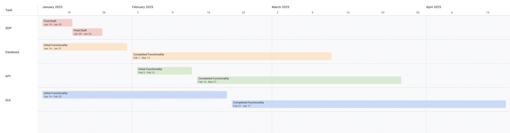
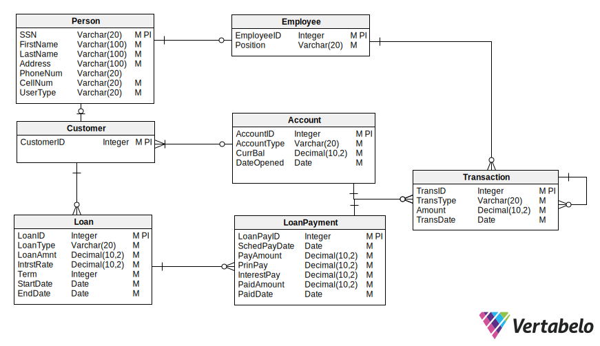

= Bank Management System
Braden Doty; Taiyo Hino; Bailee Segars; Sierra Yerges
v1.0, 2025-01-14
:doctitle: Bank Management Utility (BANK)
:sectnums:
:toc:
:experimental:
:icons: font

== Project Overview
=== Project Description
The Bank Management Utility (BANK) is a secure, web-based application that helps banks manage customer accounts. It supports three main user roles: *Customers*, *Tellers*, and *Administrators*, each with specific access and responsibilities. This system supports multiple account types, such as checking, savings, money market, home mortgage loans, and credit card accounts, incorporating features like deposit and withdrawal tracking, fund transfers, and online bill payments, all within a secure, user-friendly interface.

Prioritizing security, the system includes robust authentication, encrypted data handling, and role-based access controls to ensure that sensitive customer information remains protected at all times. Error handling and transaction validation further enhance the security of the application.

=== Project Objectives
.*Secure User Access*
* Use secure login credentials for all users (username and password).
* Implement encrypted data storage and transfer to safeguard sensitive information.

.*Support Key User Roles*
* Customer: Create and manage personal accounts, view transaction reports, transfer funds, and pay bills.
* Teller: Manage customer accounts, handle transactions, and review account data.
* Administrator: Oversee teller accounts and access all system data for maintenance.

.*Include Core Banking Features*
* Support multiple account types with unique features like interest rates and monthly payments.
* Facilitate deposits, withdrawals, and transfers while enforcing restrictions for certain account types.

.*Ensure Usability*
* Provide a simple, intuitive interface suitable for non-technical users.
* Design the system to handle errors and recover from input mistakes.

.*Enable Scalability*
* Allow multiple users to access the system at the same time.
* Support future updates, such as adding more account types or enhancing security.

.*Use Reliable Data Management*
* Store account data in a secure database or similar storage system for real-time access and updates.

== Project Schedule
.Timeline View of Project Schedule

=== Important Dates
* *1/26*: SDP Presentation
* *2/09*: Backlog Presentation
* *2/23*: Architectural Design Presentation
* *4/20*: Final Presentation
* *4/27*: Final Project Due 

== Personnel and Roles
=== Braden Doty
*Software Developer*

.Braden

- Current Assignments:
  * US-10 - Put Risks, Issues, and Mitigations into Asciidoc
  * AI-04 - Research Website Banking Design
  * AI-05 - Research Frontend

- Bio:
  * I am a computer science major with a concentration in Cybersecurity at UAH
  * I currently work PRN for Athens-Limestone EMS.
  * I volunteer with Monrovia Volunteer Fire Department
- Fun Fact:
  * I have my Part 107 Drone License

<<<

=== Taiyo Hino
*Software Developer*

.Taiyo

- Current Assignments:
  * US-10 - Put Risks, Issues, and Mitigations into Asciidoc
  * AI-04 - Research Website Banking Design
  * AI-05 - Research Frontend

- Bio:
  * I am currently a Senior at UAH with a computer science major and a math minor.
- Fun Fact:
  * I am Japanese.

<<<

=== Bailee Segars
*Team Lead*

.Bailee
image::img/bailee.jpg[Bailee, 320, 280]

- Current Assignments:
  * Working as team leader:
    ** Lead key decisions
    ** Propose software development languages and tools for the team to use
    ** Propose project schedule that works best for all members
  * US-01 - Create Database Logic Diagram
  * US-02 - Initialization Script for Database
  * US-03 - Initial set up of docker container
  * US-07 - Put Software Development Tools into Asciidoc
  * US-08 - Put Software Development Environment into Asciidoc
  * US-09 - Create Project Timeline Diagram

- Bio:
  * I am a computer science major at UAH who is graduating next semester
  * I have been an intern at Amentum since Summer 2023
  * I work as a TA for the CS department and a tutor for the SSC
  * This summer I will evaluate photonic HPC systems compared to CMOS HPC systems as a research intern at the NSA
  * Starting next semester, I will be an intern at SAIC
  * Interested in operating system or compiler development
- Fun Fact:
  * My favorite band is Sleep Token

<<<

=== Sierra Yerges
*Admin*

.Sierra
image::img\sierra.jpg[Sierra, 320, 280]

- Current Assignments:
  * Working as team admin/scrum master:
    ** Keeping track of meeting minutes
    ** Ensuring team member's submit individual reports
    ** Creating *action items*, *epics*, *user stories*, etc.
    ** Utilizing Jira to provide an easier way for others to track their stories
  * US-03 - Initial set up of docker container
  * US-04 - Put Project Overview into Asciidoc
  * US-05 - Put Project Schedule into Asciidoc
  * US-06 - Put Personnel and Roles into Asciidoc
  * SDP finalization/submission

- Bio:
  * I am a Senior at UAH and hopefully (finger's crossed) graduating this semester
  * I have been an intern at Northrop Grumman since Summer 2023
  * Interested in becoming a Scrum Master
- Fun Fact:
  * I have a Bengal cat

<<<

== Software Development Tools
=== Project Management
* *Tool:* Jira
* *Purpose:* Jira is used to manage the project's Agile development process, including sprint planning, task assignment, progress tracking, and issue resolution.

=== Database Management
* *Database:* CSV Files
* *Security:* SHA-256 hashing is implemented for secure password storage. User roles and permissions are managed within the database ensure data integrity and access control.
+
.Bank Management Logic Diagram

== Software Development Environment
* *Platform:* Windows
* *Editor:* Visual Studio Code
** *Extensions:* Extensions supporting Python and Bash scripting, HTML, CSS, and JavaScript are utilized within Visual Studio Code.
* *Version Control:* Git
* *Repository:* GitHub - The project's source code is hosted on GitHub for collaborative development, version control, and code sharing.

== Risks, Issues, and Opportunities
=== Risks
|===
|Impact Level |Item |Mitigation/Impact

|5
|Team Member Drops Class
|Work extra hard & redistribute tasks

|5
|Development Tool is Deprecated near/at Project Deadline
|Find similar tool to use and modify project if necessary to accomodate

|5
|System Downtime
|Have page set up to show status of database to user. Notify us (software developers) to get it back up ASAP

|4
|Miscommunication Between Group Members
|Use clear communication tools & practices like Discord & Jira

|4
|Members Are Not Meeting Deadlines
|Create realistic timelines, track progress, & hold regular check-ins

|4
|Member Has Personal Issue and Cannot Work
|Team members split up work

|4
|Security Risks
|Look into alternative algorithms to sha256. Could possibly use MD5.

|4
|Usability Challenges - GUI
|Testing of GUI prior to launch, User-centered design, and FAQ for users.

|3
|Code Integration Issues
|Use version control (e.g., Git) effectively & conduct regular code reviews

|2
|Code Does Not Work As Intended
|Allocate extra debugging time & conduct frequent testing during development
|===

=== Issues

|===
|Item |Mitigation/Impact

|Members Unfamiliar With Go
|Utilize the one knowledgeable member to mentor & share reference materials

|Members Unfamiliar With HTML/CSS
|Provide access to tutorials & reference materials for learning HTML/CSS

|Inadequate Testing Environments
|Set up proper development & testing environments

|Conflicts Within The Team
|Set up regular meetings to address concerns early & establish ground rules

|Poor Documentation
|Establish clear documentation standards (AsciiDoc)

|===

=== Opportunities

|===
|Item |Mitigation/Impact

|Early Adoption of Security Best Practices
|Saves time post-launch

|Using Modular Design
|Improves schedule and ensures faster delivery of updates

|Code Reviews and Peer Programming
|Saves schedule time by catching issues early & improves overall code performance

|Defining Scope Early
|Improves schedule predictability by minimizing unplanned work

|User Feedback During Development
|Reduces the likelihood of an unfriendly interface

|Use Tips From Previous Teams With This Project
|Reduces the likelihood of repeating mistakes, and can speed up development

|===

== Lessons Learned
Students from previous semesters provided helpful insights regarding the bank management utility project.

.Testing and Timeline
[quote, Spring 2022]
Keep in mind that the frontend testing will often require backend work to be done, so having the backend done sooner is better.

.Creating Plans
[quote, Spring 2022 Students]
Carefully look over the requirements and make a plan. Try not to have to make changes later.

.Using an API
[quote, Spring 2024 Students]
The API we started with was not compatible with the backend language, so do research on the best API tool to use with the language you plan to develop in.

.Division of Labor
[quote, Spring 2024 Students]
The best way we found as a team was to split the work 50/50 with the front and backend. The reason I this is the backend team was able to finish early and then have the time to learn the frontend process and help finish out the last pieces a lot easier than doing each piece as a group of 4.

=== Our Takeaways
As a team, we have decided to split the work based on frontend tasks and backend tasks. This is allowing us to focus on getting the backend functional as soon as possible so the frontend can be tested. 